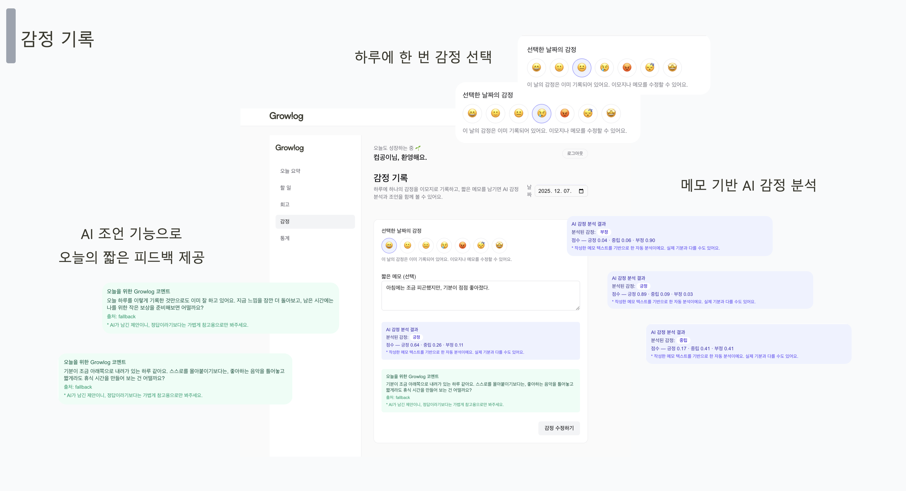
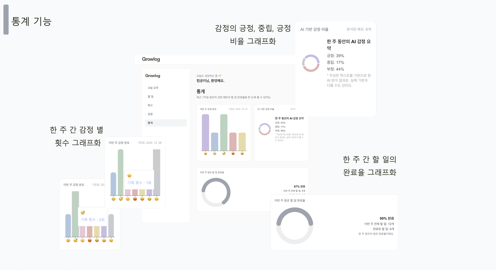

# 🤖 Growlog AI

사용자의 **감정 메모를 기반으로 감정 분석을 수행하는 AI 서비스**

Growlog 서비스에서 작성된 감정 메모를 분석하여  
**긍정 / 중립 / 부정 감정 비율을 계산하고 사용자에게 피드백을 제공**합니다.

---

## 📌 Overview

Growlog AI는 사용자가 기록한 감정 메모를 분석하여  
텍스트 기반 감정 상태를 파악하는 **AI 분석 서버**입니다.

FastAPI 기반 API 서버로 구현되었으며  
Frontend / Backend 서비스와 연동하여 감정 데이터를 분석합니다.

---

## 🎯 Purpose

- 사용자 감정 데이터를 분석하여 자기 이해 지원
- 감정 흐름을 시각화하기 위한 데이터 제공
- AI 기반 간단한 피드백 제공

---

## ⚙️ Tech Stack

### AI Server

- Python
- FastAPI
- Sentiment Analysis

### Integration

- Backend API 연동
- Frontend 시각화 데이터 제공

---

## 🧠 주요 기능

### 1️⃣ 감정 메모 기반 감정 분석



사용자가 작성한 감정 메모를 분석하여  
감정 상태를 분류합니다.

분석 결과

- 긍정
- 중립
- 부정

---

### 2️⃣ 감정 분석 결과 제공


텍스트 데이터를 분석하여  
각 감정의 확률 값을 계산합니다.

예시


긍정: 0.64
중립: 0.26
부정: 0.11


---

### 3️⃣ 감정 기반 AI 피드백 제공

AI 분석 결과를 기반으로  
사용자에게 간단한 코멘트를 제공합니다.

예시

> 오늘 하루도 잘 버텨냈어요.  
> 잠깐의 휴식이나 좋아하는 음악을 듣는 시간을 가져보는 건 어떨까요?

---

### 4️⃣ 통계 데이터 제공



AI 분석 데이터를 기반으로

- 주간 감정 분포
- 감정 변화 흐름
- 감정 비율 통계

데이터를 제공합니다.

---

## 🏗 Architecture


Growlog 시스템은 다음과 같은 구조로 동작합니다.


Frontend
↓
Backend API
↓
AI Server (FastAPI)
↓
Sentiment Analysis


---

## 📂 Project Structure

```markdown
```text
growlog-ai
├── app
│   ├── api
│   ├── model
│   ├── service
│   └── utils
├── models
├── routers
├── services
└── main.py
```

🚀 Future Improvements

감정 분석 모델 고도화

장기 감정 패턴 분석

개인 맞춤 피드백 시스템

감정 변화 예측 기능

🌱 Growlog Ecosystem

Growlog Frontend

Growlog Backend

Growlog AI

AI 분석을 통해
사용자의 감정 흐름과 행동 패턴을 연결하는 자기 관리 서비스를 목표로 합니다.


---